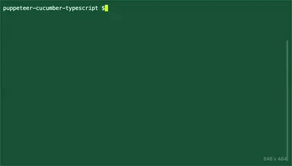
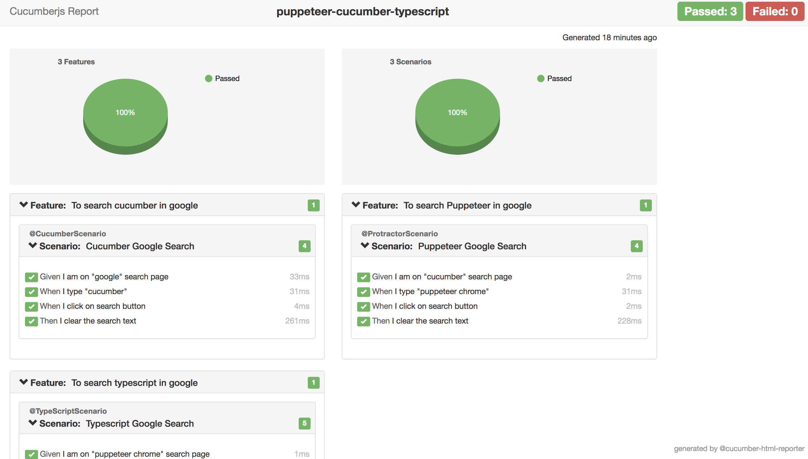
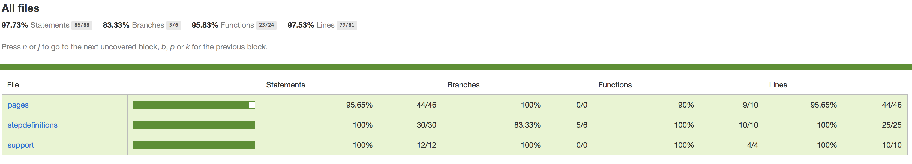

<p align="center">

</p>

<p align="center">
   <i><strong>This project demonstrates the puppeteer-cucumber-typescript framework project setup.
</strong></i>
<p>

<p align="center">
<a href="https://circleci.com/gh/igniteram/puppeteer-cucumber-typescript/tree/master"></a>
<a href="https://david-dm.org/igniteram/puppeteer-cucumber-typescript"></a>
<a href="https://opensource.org/licenses/MIT"></a>
</p>

### To Get Started

#### Pre-requisites
1.NodeJS installed globally in the system.
https://nodejs.org/en/download/

#### Setup Scripts
* Clone the repository into a folder
* Go inside the folder and run following command from terminal/command prompt
```
npm install 
```
* All the dependencies from package.json and ambient typings would be installed in node_modules folder.

#### Run tests(Headless mode) 

Just run the below command

```
npm test
```
The above command would trigger tests in chrome headless mode and generate cucumber **json** & **html** reports automatically!

The above command also would generate the **test coverage** with the help of puppeteer's jscoverage feature in conjugation with istanbul reports.

> The coverage report would be available in **coverage** folder

Pleaase check the [Test Coverage](#Coverage) section for more details


<p>

</p>

#### Run tests(Browser mode)

Just change the `init()` method in the **src/pages/pageHelper.ts** file to following -

```
public async init() {
    try {
      this.browser = await launch({
        headless: false,   <---- set this to false
        args: ['--disable-notifications', '--start-maximized'],
      });
      this.page = await this.browser.newPage();
    } catch (Exception) {
      throw new Error(Exception.toString());
    }
  }
```

#### Run tests in Windows

In windows machines due to some strange reason(need to do more debugging) cucumber is not allowing string characters in command line. So workaround is to remove them.

Please see this [issue](https://github.com/igniteram/puppeteer-cucumber-typescript/issues/10) 

Just run the below command which would run the test scripts & generate report successfully

```
npm run test-windows
```

#### Writing Features
```
Feature: To search typescript in google
@TypeScriptScenario

  Scenario: Typescript Google Search
    Given I am on google page
    When I type "Typescript"
    Then I click on search button
    Then I clear the search text
```
#### Writing Step Definitions
    
```
import { page } from '../support/hooks';
const { Given } = require('cucumber');
const chai = require('chai').use(require('chai-as-promised'));
const expect = chai.expect;

Given(/^I am on "(.*?)" search page$/, async (text) => {
    if (text === 'google') {
        await expect(page.getTitle()).to.eventually.equal('Google');
    } else if (text === 'cucumber') {
        await expect(page.getTitle()).to.eventually.equal(text + ' - Google Search');
    } else if (text === 'puppeteer chrome') {
        await expect(page.getTitle()).to.eventually.equal(text + ' - Google Search');
    }
});

```

#### Writing Page Objects
```
const searchPage: SearchPage = {
    url: 'https://www.google.com',
    searchTextBox: '#lst-ib',
    searchButton: 'input[value="Google Search"]',
    logo: 'div#logocont',
};

export {searchPage};
```
#### Cucumber Hooks
Following method takes screenshot on failure of each scenario
```
After(async (scenario) => {
    if (scenario.result.status === Status.FAILED) {
        // screenShot is a base-64 encoded PNG
         const screenShot = await page.screenshot();
         this.attach(screenShot, 'image/png');
    }
});
```
#### Cucumber-NPM scripts
Following configuration shows to call specific tags from feature files
```
"scripts": {
    "lint": "tslint -c tslint.json 'src/**/*.ts'",
    "pretest": "ts-node ./utils/json.ts",
    "cucumber": 
        "cucumber-js ./features/*.feature 
        --require-module ts-node/register 
        --require './src/*/*.ts' 
        --format 'json:./reports/json/cucumber_report.json'",
    "report": "ts-node ./utils/reporter.ts",
    "test": "npm run cucumber && npm run report"
  }
```
#### HTML Reports
Currently this project has been integrated with [cucumber-html-reporter](https://github.com/gkushang/cucumber-html-reporter), which is generated in the `reports` folder when you run `npm test`.
They can be customized according to user's specific needs.



#### Coverage

This project has been integrated with [puppeteer-to-istanbul](https://github.com/istanbuljs/puppeteer-to-istanbul) module which helps in generating the coverage by puppeteer to istanbul reports.



## Contributions
For contributors who want to improve this repo by contributing some code, reporting bugs, issues or improving documentation - PR's are highly welcome, please maintain the coding style , folder structure , detailed description of documentation and bugs/issues with examples if possible.

## License
```   
MIT License

Copyright (c) 2018 Ram Pasala
```
